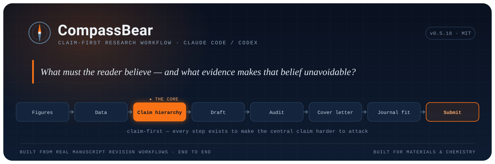
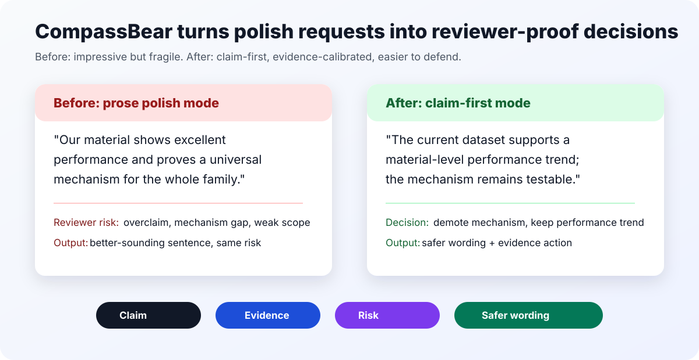

<div align="center">

# CompassBear

**The claim-first research-writing skill for Claude Code & Codex.**  
*Make your scientific story harder to attack, not just nicer to read.*

[](https://github.com/433liu/compassbear/releases)
[](LICENSE)
[](#install)
[](#why-compassbear)

**English** | [中文](README.zh-CN.md)



</div>

> **Built from real manuscript revision workflows**: figure defense, data-to-claim hierarchy, consistency audits, cover letters, rebuttal planning, and journal positioning. CompassBear packages that full-cycle pressure into a reusable research skill.



CompassBear turns scattered data, mechanisms, figures and applications into **defensible** manuscripts, proposals, cover letters, rebuttals and patent-style claim structures. It is **not** a phrase-polishing prompt. The core question it keeps asking is:

> **What must the reader believe, and what evidence makes that belief unavoidable?**

---

## 30-second demo

Input:

> Our material proves a universal mechanism from three samples and steady-state spectra.

CompassBear should return:

- **Verdict:** overclaimed.
- **Safer claim:** supports a trend in the tested family.
- **Reviewer risk:** mechanism not isolated; alternatives not excluded.
- **Next evidence:** discriminating control or orthogonal mechanism test.

## Why CompassBear

Most academic AI tools work *after* the science is settled: they polish prose, summarize papers, format documents, or imitate reviewer comments. CompassBear works one layer earlier: whether the scientific argument itself can survive review.

| Capability | Quick polish prompt | Journal-style writing skill | **CompassBear** |
|---|:---:|:---:|:---:|
| Sentence-level polish | Yes | Yes | Hands off when polish is enough |
| Section drafting in journal style | Partial | Yes | Yes |
| **Claim hierarchy: "is this defensible?"** | No | Partial | **Yes** |
| **Figure-as-argument + reviewer-risk mapping** | No | Partial | **Yes** |
| **Demotion language when evidence is only suggestive** | No | No | **Yes** |
| **Journal positioning across Nature-family / JACS / Angew / AM / mainstream venues** | No | Partial | **Yes** |
| Cover letters, rebuttals, response planning | Partial | Yes | **Yes** |
| Research-council direction debate | No | No | **Yes** |

> Use CompassBear to make the *story* defensible, then pair it with a polishing or formatting tool when the argument is already safe.

## What It Does

**Story & structure**

- Builds manuscript claim hierarchies and paper framings: mechanism, method, platform, or application.
- Rebuilds Abstracts, Introductions, Results and Conclusions from your actual claims and notes.
- Audits consistency across numbers, terms, figures, SI, cover letters and rebuttal text.

**Figures**

- Designs figure logic, panel maps, captions and graphical abstracts as **arguments**, not decoration.
- Identifies which panels belong in the main figure, Extended Data or SI.
- Produces handoff specs for visual tools without fabricating data-looking evidence.

**Submission**

- Reframes the same manuscript for Nature-family, JACS, Angew, Advanced Materials or more specialized journals.
- Drafts cover-letter logic, reviewer suggestions and point-by-point response plans.
- Checks SI, Methods, data availability and reproducibility language.

**Strategy**

- Runs role-based research-council debates for project direction and paper angle.
- Controls high-risk claim boundaries and likely reviewer attacks.
- Performs token-lean literature scouting before expensive full-paper reading.

**Local expert lenses**

- Private/local workflows can connect source notes, PDFs and reference-manager libraries to source-backed expert lenses.
- The public build does **not** ship private mentor cards, personal rosters, unpublished project notes or local databases.
- The goal is to extract decision standards from sources, not to impersonate any real person.

## Born From Real Manuscript Work

CompassBear was not designed as a toy prompt pack. Its rules came from the pain points of real manuscript work:

```text
organize figures -> analyze data -> build the claim hierarchy -> draft
-> audit consistency -> write the cover letter -> plan rebuttals
-> position the journal -> submit
```

Every sub-skill exists because one of these steps can break a paper. That is why CompassBear defaults to **defensibility**: demote claims the evidence cannot carry, map each figure to the belief it must force, and separate literature support from project-specific proof and unsupported analogy.

## Built First For Materials & Chemistry

CompassBear is field-agnostic, but its reference cases and figure vocabulary were shaped by materials science and chemistry workflows. Researchers in materials, chemistry, applied physics and adjacent engineering fields will likely feel the least friction.

## Lightweight By Design

A single root skill, `compass-bear`, routes to focused modules: writing, figure strategy, consistency audit, research council, cover letters, reviewer responses, SI/Methods and patent-style boundaries.

No heavy framework is required to start. The public package is a clean, installable skill tree; private Zotero, PDF, Word or expert-lens workflows should stay local.

## Install

Clone the repository:

```bash
git clone https://github.com/433liu/compassbear.git compass-bear
```

Install the cloned `compass-bear` folder as a local skill, then restart your agent and invoke:

```text
$compass-bear
```

See [INSTALL.md](INSTALL.md) for details.

## Try It

```text
$compass-bear
Audit this abstract for claim discipline, evidence hierarchy and AI rhythm.
```

```text
$compass-bear
Use a research council to debate whether this project should be framed as
mechanism, method, platform or application.
```

```text
$compass-bear
Build a claim-first figure map for Figure 2 and decide what belongs in main,
Extended Data and SI.
```

```text
$compass-bear
Compare JACS, Angew, Advanced Materials and Nature-family positioning for this
story. What is the claim ceiling for each target?
```

## Public Package Contents

```text
compass-bear/
├── README.md
├── README.zh-CN.md
├── LICENSE
├── INSTALL.md
├── SKILL.md
├── commands/
├── agents/
├── skills/
├── scripts/
├── examples/
├── references/
└── evals/
```

This public build intentionally excludes API keys, generated outputs, personal project rosters, private mentor lens cards, local reference-manager databases, source notes from papers and unpublished manuscript-specific material.

## Honest Limits

CompassBear is heavier than a quick prompt and needs real evidence from you for high-stakes claims. It cannot replace literature reading, experimental validation, statistical review, legal counsel or final journal formatting.

Use it when the bottleneck is:

> "Make this story harder to attack."

not merely:

> "Make this sound better."

## Read Next

- [INSTALL.md](INSTALL.md): installation
- [SKILL.md](SKILL.md): root skill behavior
- [examples/live-smoke-test.md](examples/live-smoke-test.md): complete public smoke-test transcript
- [examples/benchmark-suite.md](examples/benchmark-suite.md): public benchmark prompts
- [examples/compassbear-output-gallery.md](examples/compassbear-output-gallery.md): output examples
- [SHOWCASE.md](SHOWCASE.md): GitHub Topics, Description and launch copy

## Co-Created Workflow

CompassBear is a human-led, AI-assisted research workflow. It was shaped through real manuscript revision sessions with Codex and Claude Code as iterative co-builders: one pushing implementation, packaging and workflow discipline; the other helping pressure-test writing, positioning and research logic.

The scientific responsibility stays with the researcher. The AI collaborators help expose weak claims, organize evidence and improve the workflow; they do not replace literature reading, experiments or expert judgment.

## Status & Contributing

CompassBear is actively developed. Issues and pull requests are welcome. If CompassBear saves you a painful revision round, a star helps other researchers find it.

## License

MIT. See [LICENSE](LICENSE).

<div align="center"><sub>This README follows CompassBear's own rule: every claim here should be one we can defend.</sub></div>
